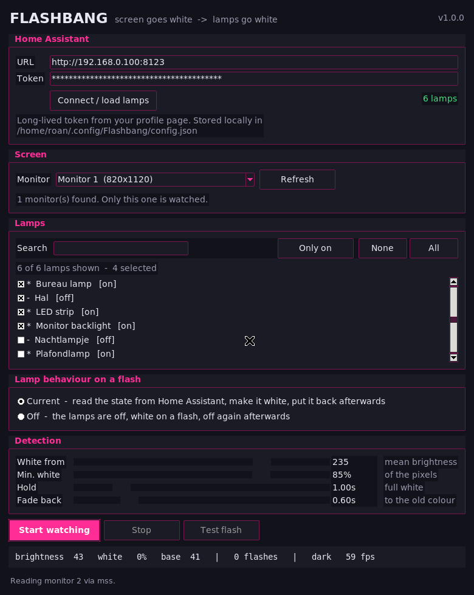

# Flashbang → Home Assistant

Watches **one monitor** of your PC. The moment that screen turns almost completely
white — a flashbang in a game, a white flash effect — it switches the Home
Assistant lamps you picked to **full white**, holds them there for a moment, and
then fades them back to exactly what they were.



This is deliberately **not** Hue Sync / AmbiBox / SignalRGB. Those mirror your
screen *continuously*, so your room flickers along with every menu and cutscene.
This one only reacts to the white-out, for about a second.

Python + Tkinter, no server, no cloud, no account. It talks straight to your own
Home Assistant over the local network.

---

## How it works

```
 monitor pixels ──► mean brightness + % white pixels
                          │
                          ├─ sudden jump to >235 brightness and >85% white?
                          │
                          ▼
        GET /api/states  (read + remember every selected lamp)
                          │
                          ▼
        light.turn_on  rgb_color 255,255,255  brightness 255  transition 0
                          │
                     hold ~1 s
                          ▼
        light.turn_on  <the colour and brightness from the snapshot>  transition 0.6
```

The trigger is a **jump**, not a state. A screen that is already white (a web
page, a document) does not fire — only a sudden transition from something dark
to something white. See [Tuning](#tuning) if it fires too eagerly or not at all.

Because the frames are read through Desktop Duplication / GDI, the lamps react
**150–300 ms** after the flash starts (HTTP + Zigbee/Thread/WiFi). A game
flashbang lasts 1–4 seconds, so it feels synced, but it is not a 1:1 video link.

---

## Install (Windows)

```bat
git clone https://github.com/roanh47/Home-Assistant-Flashbang.git
cd Home-Assistant-Flashbang
python -m pip install -r requirements.txt
python flashbang.py
```

Or double-click **`run.bat`** (starts it without a console window).

Python 3.9+ with Tkinter (included in the official Windows installer — keep the
"tcl/tk" checkbox on).

### Home Assistant side

1. In Home Assistant: click your profile (bottom left) → **Long-lived access
   tokens** → *Create token*. Copy it.
2. Paste the URL of your HA instance (`http://homeassistant.local:8123` or
   `http://192.168.0.x:8123`) and the token into the app and press
   **Connect / load lamps**.
3. Tick the lamps that should flash. Use the search box if the list is long.

The app talks to `/api/states`, `/api/services/light/turn_on` and
`/api/services/light/turn_off`. That is all it needs — no HACS integration, no
automation, no webhook.

---

## Use

1. **Connect / load lamps** — loads the `light.*` entities from your HA.
2. **Monitor** — pick the screen that shows the game. Only that one is watched.
3. **Lamps** — tick the ones that should go white.
4. Pick a mode (below).
5. **Start watching**. The status bar shows the live brightness, the % of white
   pixels, the number of flashes and the sampler fps.
6. **Test flash** fires the whole sequence once so you can check colours and
   timing without being in a game.

Settings are saved automatically when you press Start (and when you close the
window) to `%USERPROFILE%\.config\Flashbang\config.json` on Windows
(`~/.config/Flashbang/config.json` on Linux/macOS). The token is stored there in
plain text, like most local tools — that file stays on your own machine.

### Modes

- **Current** (default) — reads the state of every selected lamp *before* the
  flash (colour, brightness, temperature, effect), fires white, then puts
  everything back. Best for lamps that are usually on; a lamp that was dim and
  warm goes back to dim and warm.
- **Off** — for lamps that are normally off. They turn on full white at the
  flash, then go off again with the same fade.

---

## Tuning

| Setting | Default | What it does |
|---|---|---|
| **White from** | 235 | Mean brightness (0–255) the frame must reach. Lower = more sensitive. |
| **Min. white** | 85 % | Share of pixels that must be near-255 white. |
| **Hold** | 1.0 s | How long the lamps stay fully white. |
| **Fade back** | 0.6 s | Transition time back to the old colour. `0` = instant snap. |

Inside the code there are two more knobs on `Settings`: `jump` (how much
brighter than recent frames the white-out must be, default 55) and `cooldown`
(seconds between two flashes, default 3) and `warmup` (frames ignored after
starting). Sensible defaults; only touch them if you run into trouble.

**Fires when it should not** → raise *White from* to ~245 and *Min. white* to
90 %, and raise `jump`. **Does not fire** → lower *White from* to ~225 and
*Min. white* to 75 %. Some games dim the flashbang with a vignette/blur, so the
frame never reaches 98 % white.

---

## Screen backends

- **mss** (default, pure Python) — works everywhere, 60–100 fps at a
  downscaled sample. This is what you want.
- **bettercam** (optional, Windows) — Desktop Duplication, 200+ fps. Install
  with `python -m pip install bettercam`; the app picks it up automatically and
  falls back to mss if anything goes wrong.

Frames are never resized or saved. Only every 8th pixel is sampled and reduced
to two numbers, so the CPU cost is a couple of percent.

---

## Build a single .exe

```bat
build.bat
```

Produces `dist\Flashbang.exe` (no console window). Drop a shortcut in
`shell:startup` if you want it to run from boot.

---

## Troubleshooting

- **"Cannot reach Home Assistant"** — check the URL in a browser; the token must
  be a *long-lived access token*, not the login password. HA must allow the
  connection over the LAN.
- **Lamps go white but do not come back** — a lamp rejected the restore call
  (usually a colour it does not support). Check the log line under the buttons;
  the app never leaves them on purpose, but a lamp that is offline at that
  moment cannot be reached.
- **Nothing happens** — press *Test flash*. If that works, the detector is the
  problem: lower *White from* and *Min. white*.
- **Fires on bright web pages** — raise the thresholds, or drop `cooldown`
  tolerance by unticking lamps you care less about.

## Limitations

- One flash at a time, and at least `cooldown` (3 s) between two flashes.
- A long-lasting white screen is treated as *not* a flashbang once it exceeds
  ~2.5 s, so an always-white page will not keep re-triggering the lamps.
- Lamps that are unreachable during the flash are skipped rather than retried.
- Windows is the target; it runs on Linux/macOS too but the Desktop Duplication
  speed-up does not exist there.

## Tests

```bash
python -m unittest discover -s tests -v
```

51 tests: the flash detector (jump detection, cooldown, re-arming, warm-up),
the light payloads per colour mode, the snapshot/restore round-trip, config
handling, and a full end-to-end flash sequence against a real local HTTP server
that speaks the Home Assistant API. No display, Home Assistant or lamps
required.

## License

MIT — see [LICENSE](LICENSE).
